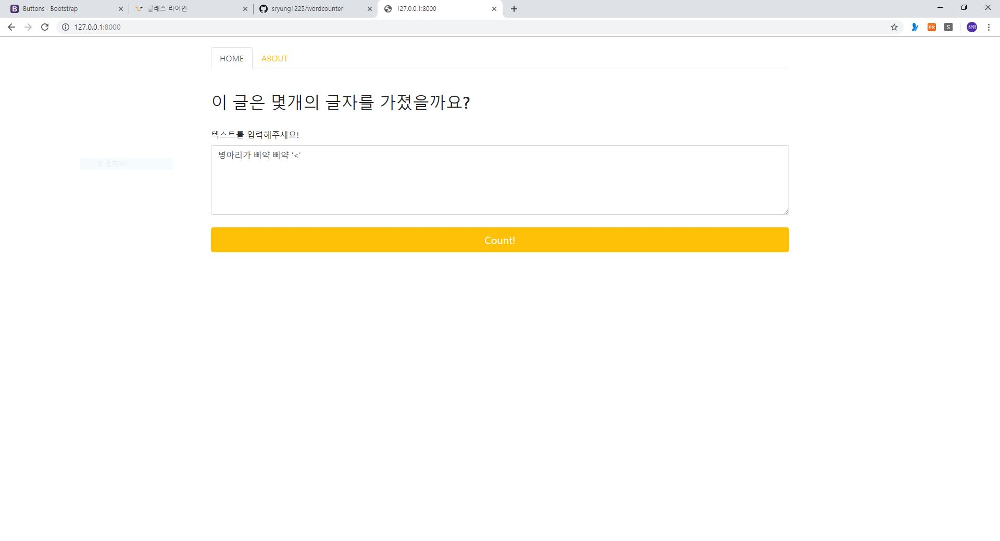
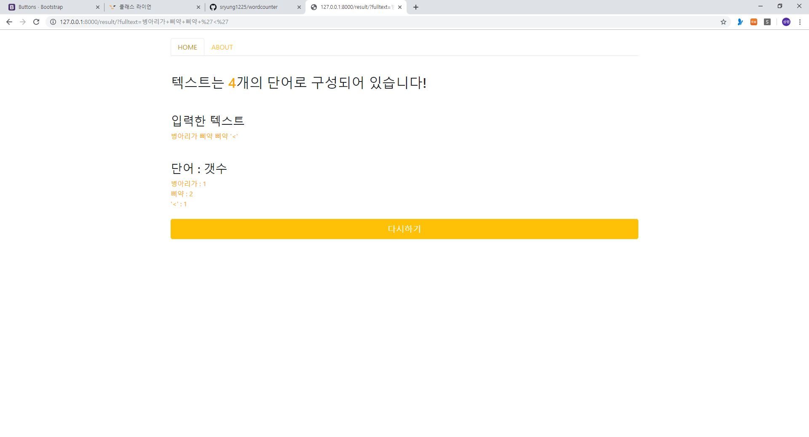
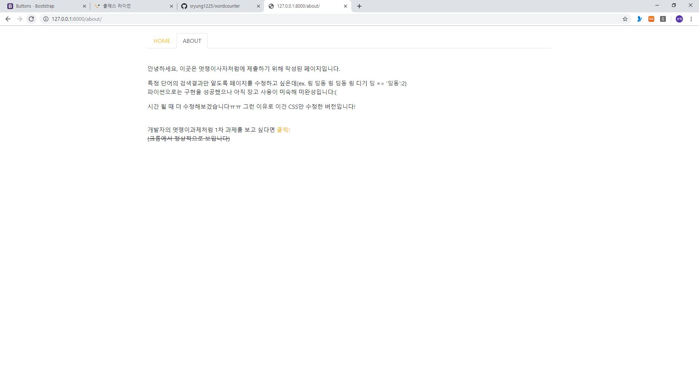

# Word Counter!
> ~ 19.05.13  
> 멋쟁이사자처럼 7기 과제

 

## 목차
1. 프로젝트 설명
2. 사진

 

## 1. 프로젝트 설명
django를 이용한 기초 소규모 프로젝트입니다.  
사용자가 텍스트를 입력하면 총 단어의 갯수와 중복 단어의 갯수를 세주는 사이트입니다.  
기본적인 html과 css를 배운 뒤 이와 bootstrap을 이용해 페이지를 꾸미고 데이터를 view에서 가공해 template으로 옮기는 과정을 연습합니다.  

 

## 2. 사진
  
→ 메인 페이지 : 사용자가 텍스트를 입력

  
→ 결과 페이지 : 입력된 텍스트의 단어 갯수 분석

  
→ 설명 페이지 : 프로젝트를 설명하는 페이지 (미완)
